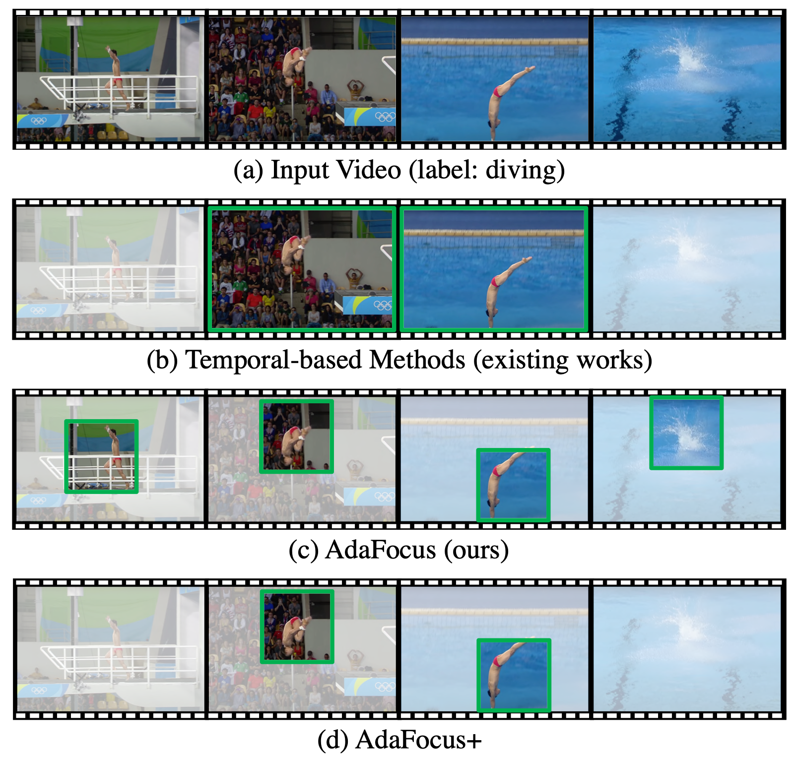
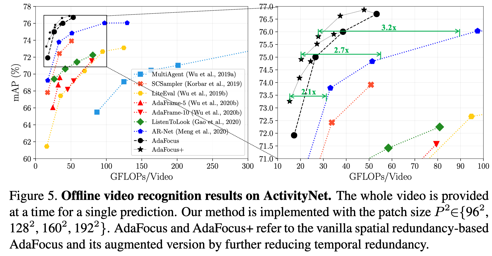
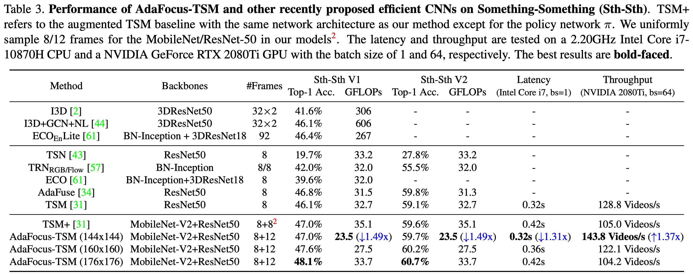
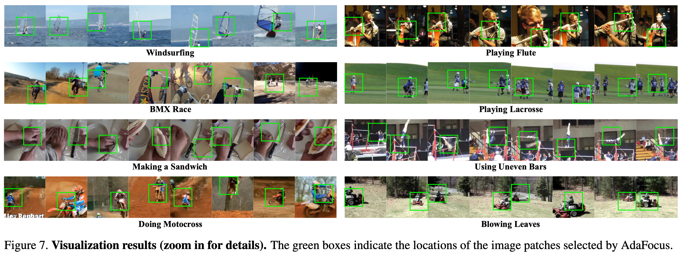

# AdaFocus (ICCV-2021 Oral)

This repo contains the official code and pre-trained models for AdaFocus.

- [Adaptive Focus for Efficient Video Recognition](http://arxiv.org/abs/2105.03245)

**Update: The latest version of the AdaFocus series, [Uni-AdaFocus (TPAMI'24)](https://github.com/LeapLabTHU/Uni-AdaFocus) has been released!** This repository is no longer maintained.

## Reference
If you find our code or paper useful for your research, please cite:
```
@InProceedings{wang2021adafocus,
    author = {Wang, Yulin and Chen, Zhaoxi and Jiang, Haojun and Song, Shiji and Han, Yizeng and Huang, Gao},
     title = {Adaptive Focus for Efficient Video Recognition},
 booktitle = {Proceedings of the IEEE/CVF International Conference on Computer Vision (ICCV)},
     month = {October},
      year = {2021}
}

@InProceedings{wang2022adafocusv2,
    author = {Wang, Yulin and Yue, Yang and Lin, Yuanze and Jiang, Haojun and Lai, Zihang and Kulikov, Victor and Orlov, Nikita and Shi, Humphrey and Huang, Gao},
     title = {AdaFocus V2: End-to-End Training of Spatial Dynamic Networks for Video Recognition},
 booktitle = {Proceedings of the IEEE/CVF Conference on Computer Vision and Pattern Recognition (CVPR)},
      year = {2022}
}
```

## Introduction

In this paper, we explore the spatial redundancy in video recognition with the aim to improve the computational efficiency. It is observed that the most informative region in each frame of a video is usually a small image patch, which shifts smoothly across frames. Therefore, we model the patch localization problem as a sequential decision task, and propose a reinforcement learning based approach for efficient spatially adaptive video recognition (AdaFocus). In specific, a light-weighted ConvNet is first adopted to quickly process the full video sequence, whose features are used by a recurrent policy network to localize the most task-relevant regions. Then the selected patches are inferred by a high-capacity network for the final prediction. During offline inference, once the informative patch sequence has been generated, the bulk of computation can be done in parallel, and is efficient on modern GPU devices. In addition, we demonstrate that the proposed method can be easily extended by further considering the temporal redundancy, e.g., dynamically skipping less valuable frames. Extensive experiments on five benchmark datasets, i.e., ActivityNet, FCVID, Mini-Kinetics, Something-Something V1\&V2, demonstrate that our method is significantly more efficient than the competitive baselines.


<p align="center">
    
</p>


## Result

- ActivityNet

<p align="center">
    
</p>


- Something-Something V1&V2

<p align="center">
    
</p>


- Visualization

<p align="center">
    
</p>

## Get Started

Please go to the folder [Experiments on ActivityNet, FCVID and Mini-Kinetics](Experiments%20on%20ActivityNet,%20FCVID%20and%20Mini-Kinetics/) and [Experiments on Something-Something V1&V2](Experiments%20on%20Something-Something%20V1&V2) for specific docs.


## Contact
If you have any question, feel free to contact the authors or raise an issue. 
Yulin Wang: wang-yl19@mails.tsinghua.edu.cn.
